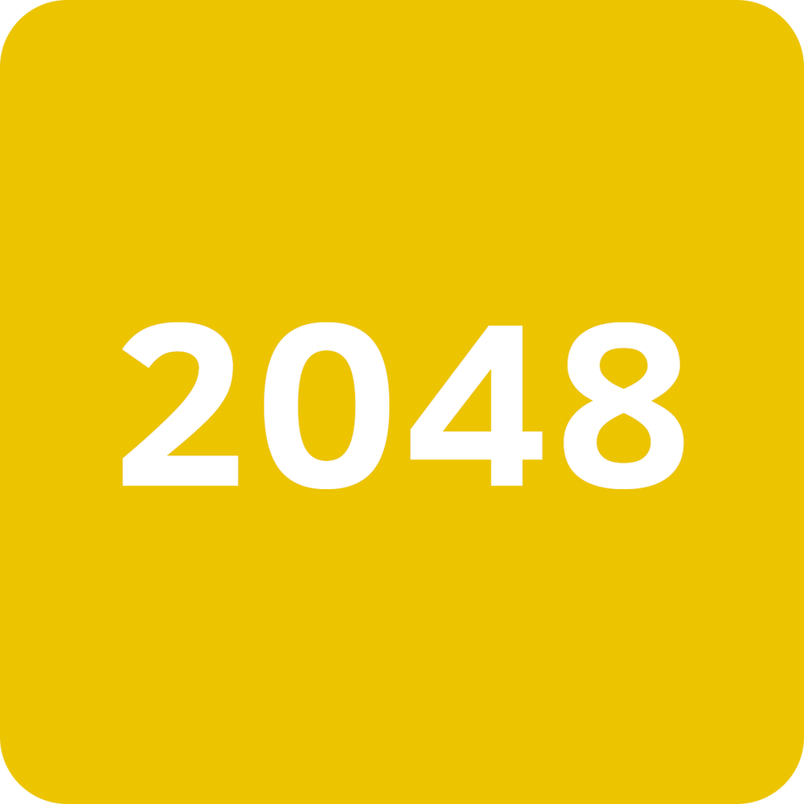

# 2048

Esta é uma aplicação simples que simula o jogo 2048 que fiz para fins educativos.

Seu objetivo é juntar os blocos iguais até que o valor de um deles chegue a 2048.

Use as setas do teclado para jogar, ou se usar dispositivo movel use os gestos de arrastar.

A lib **jquery** foi usada para manipulação de eventos e animações dos tiles.
